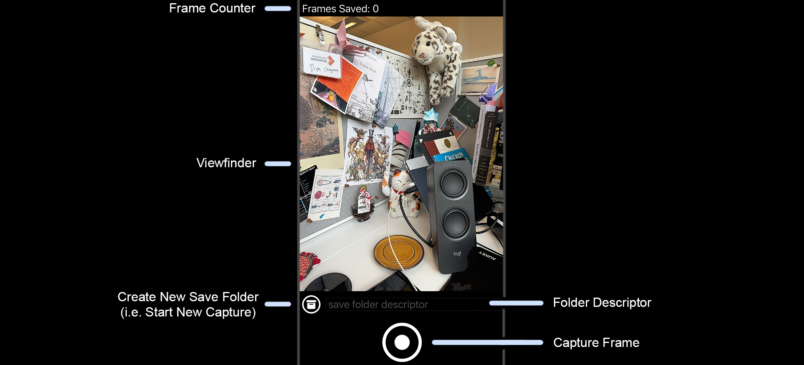

# NeRFs on the Go: ARKit → Instant-NGP

 

A concise pipeline for training NeRFs on your own iPhone scenes.

We provide conversions for various ARKit-based iPhone apps into the canonical `transforms.json`-based form used to train NeRFs. For training, we focus on Instant-NGP (we use the PyTorch implementation from [here](https://github.com/ashawkey/torch-ngp)) which is fast and lightweight.

# Setup

Create a conda environment with Python 3.7.16, and install dependencies:
```
conda create -n ngp python=3.7.16
conda activate ngp
conda install pip
pip install -r requirements.txt
```
Note that we specified dearpygui 1.9.0 in the requirements, as other versions do not work on Della.

# Capture and convert

Note that ARKit requires a lidar sensor, which is present on the Pro (and Pro Max) versions of iPhone 12, 13, and onward.

## Using the Record3D app

Record3D can be downloaded from the [https://record3d.app/](App Store) and works with the aforementioned iPhones.
1. Use Record3D to capture a video of the scene - slowly move around the scene during the video.
2. Find the video in the library, and swipe right on it and select export, specifying "Shareable/Internal format (.r3d)".
2. Transfer the exported data to your computer.
3. Replace the .r3dextension with .zip, unzip the file, and move the resulting directory into the repository.
4. Run the preprocessing script `python record3d2nerf.py [directory_name_here]`. If you captured the scene in the landscape orientation, add the `--rotate` flag.

Credit goes to the Record3D developers for app creation, and developers of the original [instant-ngp repository](https://github.com/NVlabs/instant-ngp/tree/master) for integration information.

## Using Ilya's ARCam app

To get the app: talk to Michael or Prof. Heide to get set up with a phone with Ilya's ARCam app pre-installed.

To capture and process the captured data:
1. Use capture app *in the portrait orientation* to capture some pictures of the scene - each shutter press generates a new frame.
2. The raw scene captures will be available in a newly created bundle subdirectory titled `bundle-[date and time]/` under the ARCam directory in the Files app on the iPhone. Transfer (e.g. AirDrop) this new subdirectory under the `data_ARCam/` repository directory, and rename it into something of the form `data_[scene_name_here]/`.
3. Run `bash process.sh [scene_name_here]` to generate processed NeRF-formatted data, which will be available at `data_processed_ARCam/data_processed_[scene_name_here]`.

Credit goes to Ilya for making the app.

# Training and beyond

Once our data is processed, we can start training NeRFs and do other fun things!

To train an InstantNGP on a scene for 200 iterations:
```
python main_nerf.py data_processed_ARCam/data_processed_[scene_name_here] --workspace [output_directory_name_here] --iters 200
```

To render a scene from an already-existing trained NeRF:
```
python main_nerf.py data_processed_ARCam/data_processed_[scene_name_here] --workspace [output_directory_name_here] -O --test
```

Other Instant-NGP and NeRF-related functionality are listed in the main README linked [here](https://github.com/ashawkey/torch-ngp#usage), and also provided in the file `readme_torch_ngp.md`.
